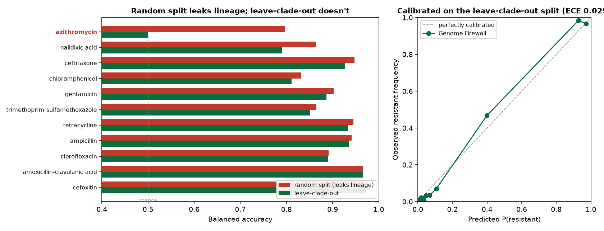
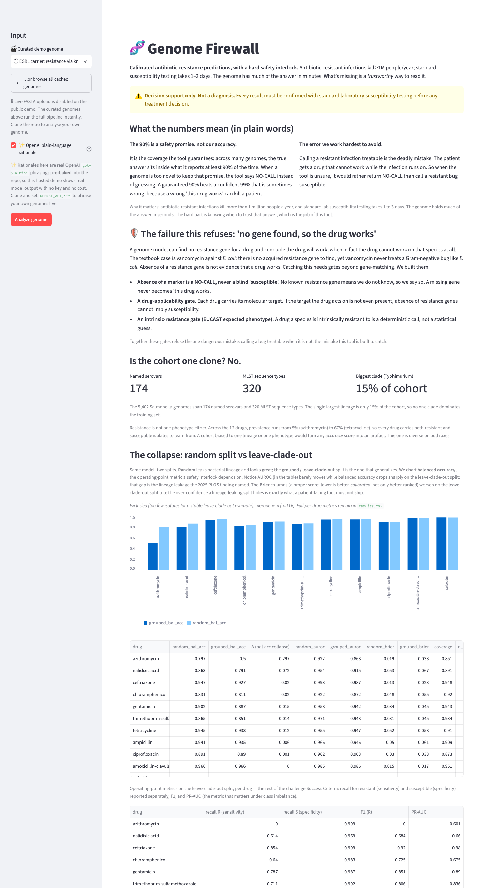
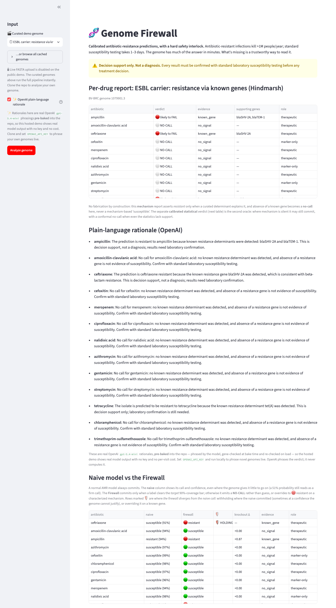
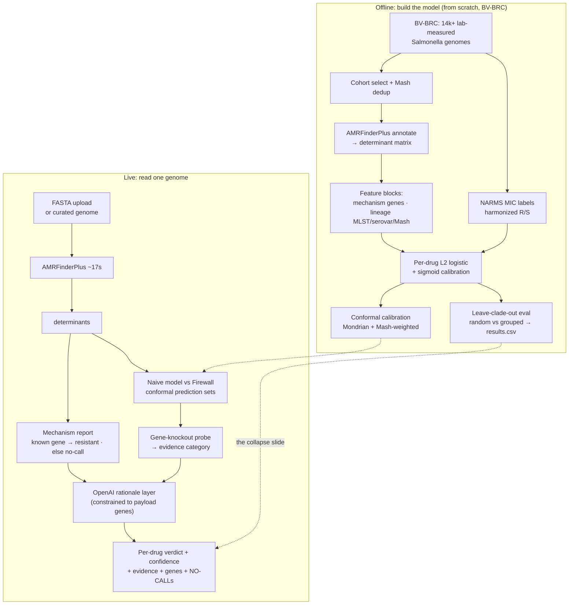

# 🧬 Genome Firewall

**▶ Live demo: https://most-reliable-genome-firewall.streamlit.app/**. Click a curated
Salmonella genome and watch the firewall hold. *(Research use only, not for clinical decisions.
If the link is down, run it locally in one command. See [Run it](#run-it).)*

<p align="center">
  
</p>

<sub>**Left** — the same model scored on a random split (which leaks lineage and inflates the number) vs a leave-clade-out split. Azithromycin drops from 0.80 to 0.50 balanced accuracy: it had learned lineage, not mechanism, and the firewall abstains there. Gene-driven drugs (ampicillin, ceftriaxone, …) hold on clades never seen in training. **Right** — on the leave-clade-out split the confidence scores are calibrated (ECE 0.025, Brier 0.042). Both panels are generated from the committed `data/results.csv` and `docs/assets/reliability.csv` by [`scripts/make_hero.py`](scripts/make_hero.py); no number is hand-picked.</sub>

An AMR model that reports a calibrated confidence and abstains when the genome falls outside what it can support.

Genome Firewall reads a bacterial genome and, per antibiotic, tells a clinician *likely to work
/ likely to fail / no-call*, each with a calibrated confidence, the evidence category
(known resistance gene · statistical-only · none), and the supporting genes. It declines to
answer when the genome falls outside its support. Strictly defensive decision
support; every result is stamped "confirm with standard laboratory susceptibility testing."

> Built for the OpenAI × Hack-Nation *Genome Firewall* challenge (06). Starting species:
> **Salmonella** (uniform NARMS panel; 5,402 lab-measured genomes, selected from BV-BRC's 14k+ pool).

---

## The problem (why this matters)

Antibiotic-resistant infections kill **>1 million people a year**. When a patient is septic,
standard lab susceptibility testing takes **1 to 3 days**, and in that window doctors *guess* an
empiric antibiotic. Every wrong guess costs the patient time and breeds more resistance.

The genome already holds much of the answer in **minutes**. What's missing isn't another
accuracy number. The easy *Salmonella* cases are already ~98% solved by tools like ResFinder,
and any clinical microbiologist knows it. What's missing is a **trustworthy** way to read a genome: one that
distinguishes *"this call is grounded in a characterized resistance mechanism"* from *"this is a
statistical hunch riding on the bug's family tree,"* and that abstains rather than guess.

## Why it's different: evaluation that doesn't leak lineage

A 2025 PLOS Biology finding is the starting point: AMR models tend to learn bacterial
lineage rather than resistance mechanism. More data doesn't fix it. A model that scores 95% on a
random test split can be right for the wrong reason, and it drops to chance the moment it meets
a lineage it hasn't seen. That is the model you should not put near a patient.

Genome Firewall is a calibrated AMR predictor with a hard safety interlock. Instead of chasing that
95%, it reports what a genome can and cannot tell you:

- **Leave-clade-out evaluation.** Every drug is scored on a leave-clade-out split, not a
  lineage-leaking random one. We show both, side by side, so the gap is visible.
- **Conformal no-call.** Per-drug conformal prediction sets give a distribution-free coverage
  guarantee; when neither *resistant* nor *susceptible* clears the bar, the firewall emits a
  NO-CALL instead of a confident wrong answer.
- **Mechanism vs. lineage.** A gene-knockout probe zeroes a drug's resistance
  genes and re-predicts: if the call holds, it was riding lineage, not mechanism. Three
  evidence tiers: *known gene · statistical-only · no signal*.
- **No fabrication.** The mechanism report asserts *resistant* only when a curated determinant
  explains it; absence of a known gene becomes a no-call, never a mechanism-based "susceptible."

## The headline result

Same model, two splits:

| Drug | Random split (leaks lineage) | Leave-clade-out | What it means |
|---|---|---|---|
| **azithromycin** | bal-acc 0.797, AUROC 0.922 | bal-acc 0.500, AUROC 0.868 | ranking survives, but the operating point drops to chance — lineage leakage in a single row |
| ampicillin | 0.941 | 0.935 | β-lactamase-driven → mechanism holds across clades |
| ceftriaxone | 0.947 | 0.927 | ESBL-driven → holds |
| tetracycline | 0.945 | 0.933 | *tet* efflux → holds |

Gene-driven resistances generalize; the lineage-driven ones drop sharply on the leave-clade-out split.
Genome Firewall reports the leave-clade-out number and abstains where it must. (A *known-gene* baseline is
shown per drug so you can see how much the statistical model adds beyond "just look up the gene.")

## See it

**The collapse**: same model, random split (light) vs leave-clade-out (dark);
azithromycin drops to chance:



**The firewall holding the line**. An ESBL carrier: the naive model says ceftriaxone is fine, the
firewall overrides to 🔴 resistant on the gene (🛡️ HOLDING), and OpenAI phrases each verdict
using only the genes actually found:



*(More in [`docs/assets/`](docs/assets/); the demo is deterministic, so these are exactly what you
see in the live app.)*

---

## Run it

Requires Python ≥3.12 (via [uv](https://docs.astral.sh/uv/); 3.14 recommended for local dev) and, for *live* genome annotation,
`ncbi-amrfinderplus` (the curated demo genomes are pre-annotated, so the demo runs without it).

```bash
uv sync --extra demo
# optional: enables the OpenAI plain-language rationale layer (falls back to a template without it):
export OPENAI_API_KEY=sk-...            # or drop it in ~/.hack.env

uv run --extra demo streamlit run demo/app.py
```

Open the URL, pick a **curated demo genome** in the sidebar (or upload any *Salmonella* FASTA),
and hit **Analyze genome**. In ~17s you get the per-drug mechanism report, the **naive-vs-firewall**
verdicts with the knockout probe, and the collapse slide.

This repo ships the three curated genomes with their cached AMRFinderPlus annotations, the trained
models, and the evaluation results. So a **fresh clone runs all three demo beats + the collapse
slide fully offline**, with no AMRFinderPlus install and no network. (Uploading your *own* FASTA
is the only path that needs a live AMRFinderPlus.)

Verify the whole thing is green and the demo surface is deterministic:

```bash
uv run pytest -q                      # full test suite
uv run python scripts/preflight.py    # stage-readiness checks
uv run python scripts/smoke_demo.py   # renders every demo surface, RED on any drift
```

## How it works



**Determinism-first:** parsing, joins, the knockout probe, conformal sets, and every verdict are
*computed in code*. No model is asked to do arithmetic. An LLM is used only for the one thing code
can't do well: phrasing.

---

## 🔌 Sponsor integration: OpenAI (constrained by design)

OpenAI does exactly one job in Genome Firewall. It can **never** touch a verdict.

- **What it does.** After every per-drug prediction is *already computed*, OpenAI (`gpt-5.4-mini`)
  turns it into one or two sentences of plain-language rationale for a lab scientist. The verdict,
  confidence, and evidence are fixed inputs; OpenAI phrases them, it does not decide them.
- **Hard-constrained to prevent fabrication.** The prompt (`prompts/rationale.txt`, versioned as
  data, never inlined) allows the model to reference **only the genes in that prediction's payload**.
  Every returned sentence is then re-scanned with a gene-shape regex: **any gene the model names that
  we did not compute → the whole answer is rejected and the deterministic template is served
  instead.** Absence of a gene is never allowed to imply susceptibility. This is the NO-FABRICATION
  doctrine enforced at the payload boundary.
- **Cannot break the demo.** Optional behind a flag + key; **12s timeout**, one retry, a running
  token counter with a hard **\$20 cap**, and an on-disk pre-baked cache
  (`scripts/bake_rationales.py`) so the curated beats serve their *real* OpenAI phrasings instantly
  and offline. Every failure mode (no key, no network, timeout, cost cap, fabricated gene) falls
  back to the template. **No exception ever escapes `explain()`.**

```
prompts/rationale.txt   ── HARD CONSTRAINTS: "You may ONLY reference genes from this list: {supporting_genes}"
src/genome_firewall/rationale.py
    explain()               ── disk cache → in-mem cache → OpenAI call → gene-regex gate → template fallback
    _mentions_foreign_gene()  ── rejects any answer naming a determinant outside the payload
```

The result: a useful natural-language layer over a deterministic core, where the
sponsor tech does real work but cannot change a verdict.

---

## Layout

| Path | What |
|---|---|
| `src/genome_firewall/` | dependency-light core: annotate, features, calibration, conformal, knockout, report, rationale |
| `demo/` | thin Streamlit app + testable display seams (`verdict.py`, `collapse.py`, `report_table.py`) |
| `scripts/` | pipeline (`pull_data` → `annotate` → `train_models` → `run_evaluation`) + `preflight` / `smoke_demo` |
| `prompts/` | OpenAI prompt as versioned data |
| `data/` | cohort, determinant matrix, `results.csv`, curated demo genomes (box-local artifacts) |
| `docs/adr/` | architecture decision records (the *why* behind each irreversible choice) |

## Scope & honesty guardrails

One species (*Salmonella*), ~12 drugs, one happy path. No deep-learning genomic LM, no
organism-design. **Defensive decision support only.** Because there is no shared held-out
benchmark, results are **not** cross-team comparable and there is no leaderboard number to chase; we
compete on methodology, calibration, honesty, and product. Every screen carries: *confirm with
standard laboratory susceptibility testing before any treatment decision.*

---

*Built during Hack-Nation. Prior art it deliberately isn't: a thin API wrapper, a RAG-over-PDF
chatbot, or a recolored template.*
